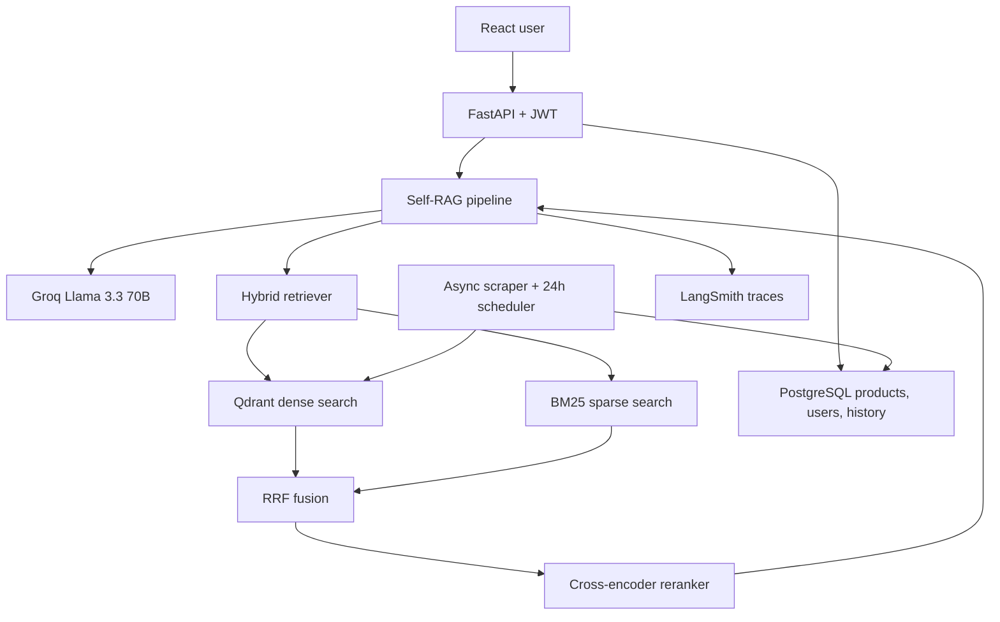

# TrayaSearch AI

TrayaSearch AI is a production-oriented e-commerce product discovery assistant. It
uses a Self-RAG pipeline to decide when retrieval is needed, combine semantic
and keyword search, rerank candidates, verify relevance, and reject answers that
are not grounded in the product catalog.


## What This Project Includes

- A Self-RAG product advisor that decides when product retrieval is needed and
  answers only from catalog-backed context.
- Hybrid product search using Qdrant dense vectors, BM25 keyword retrieval, RRF
  fusion, and cross-encoder reranking for stronger product matching.
- Real Groq LLM integration with `llama-3.3-70b-versatile` for conversational,
  grounded product recommendations.
- Built-in answer safety checks: retrieval gating, document relevance scoring,
  groundedness verification, query rewriting, and low-confidence fallback.
- JWT-based authentication with registration, login, protected chat, and
  PostgreSQL-backed chat history.
- A RAGAS evaluation workflow with a 25-query test set, saved metric scores, and
  a protected metrics dashboard.
- Async product scraping support with optional 24-hour APScheduler sync into
  PostgreSQL and Qdrant.
- LangSmith tracing hooks, Docker Compose local setup, and Render deployment
  configuration for production readiness.

## Architecture



## Self-RAG Flow

1. Decide whether the query needs product retrieval.
2. Retrieve the top 20 candidates using dense and sparse search.
3. Fuse both rankings using RRF and rerank to the final top 5.
4. Check each candidate for relevance.
5. Generate a response using only relevant products.
6. Check whether the answer is grounded in those products.
7. Rewrite and retry up to two times before returning a low-confidence warning.


## Local Setup

Prerequisites: Docker Desktop and Docker Compose.

```bash
cp .env.example .env
openssl rand -hex 32
```

Put the generated value in `SECRET_KEY` and add a Groq API key to `.env`.
LangSmith and Qdrant Cloud keys are optional for local development.

```bash
docker compose up --build
```

Services:

- Frontend: `http://localhost:3000`
- Backend API docs: `http://localhost:8000/docs`
- Qdrant dashboard: `http://localhost:6333/dashboard`
- PostgreSQL: `localhost:5432`

The backend creates tables, imports `data/products.json` when the product table
is empty, builds the BM25 index, and synchronizes Qdrant during startup.

## Environment Variables

| Variable | Purpose |
| --- | --- |
| `DATABASE_URL` | Async PostgreSQL or SQLite connection URL |
| `QDRANT_URL`, `QDRANT_API_KEY` | Local Qdrant or Qdrant Cloud connection |
| `GROQ_API_KEY`, `GROQ_MODEL` | Real LLM generation and Self-RAG judgments |
| `SECRET_KEY` | JWT signing secret |
| `SCRAPER_ENABLED` | Enable the 24-hour product scrape job |
| `LANGCHAIN_API_KEY` | LangSmith tracing key |
| `ALLOWED_ORIGINS` | Comma-separated frontend origins |
| `VITE_API_URL` | Frontend backend URL |


Example chat body:

```json
{"query": "I have dandruff and a sensitive scalp"}
```

## Evaluation

The realistic 25-query test set is in
`backend/app/evaluation/test_queries.json`. Run evaluation after configuring the
required evaluator API key and starting Qdrant.

Latest RAGAS status:

| Metric | Latest result |
| --- | --- |
| Status | `completed` |
| Faithfulness | `0.7775` |
| Answer relevancy | `0.8902` |
| Context precision | `0.76520` |
| Context recall | `0.8533` |
| Evaluated queries | `3` |
| Metric jobs | `12` |
| Judge model | `llama-3.1-8b-instant` |
| Mode | Safe mode, deterministic retrieval-grounded answers |


```bash
docker compose exec -T -e EVAL_DISABLE_TRACING=true backend python -m app.evaluation.run_evaluation
docker compose exec -T backend python -m app.evaluation.run_evaluation
```

Scores are saved to `backend/app/evaluation/scores.json` and displayed at
`/metrics`. Scores are reported from the saved JSON file; no metrics are
fabricated.


## Scraping

Set `SCRAPER_ENABLED=true` to run `scrape_and_sync` every 24 hours. The scraper
uses `httpx` and BeautifulSoup, upserts products into PostgreSQL, and rebuilds
the Qdrant and BM25 indexes. Confirm the source site's terms and robots policy
before enabling scraping in production.

