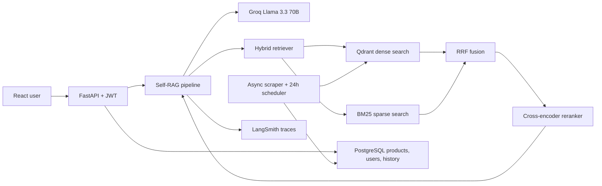

# Neusearch AI

Neusearch AI is a production-oriented e-commerce product discovery assistant. It
uses a Self-RAG pipeline to decide when retrieval is needed, combine semantic
and keyword search, rerank candidates, verify relevance, and reject answers that
are not grounded in the product catalog.

## What Changed

- Replaced ChromaDB with Qdrant dense retrieval plus in-memory BM25 sparse retrieval.
- Added Reciprocal Rank Fusion (RRF, `k=60`) and cross-encoder reranking.
- Added Groq `llama-3.3-70b-versatile` generation with grounded product prompts.
- Added Self-RAG retrieval gating, relevance checks, groundedness checks, and two retries.
- Added JWT registration/login, protected chat, and PostgreSQL chat history.
- Added a 25-query RAGAS evaluation set and protected metrics dashboard.
- Added async Traya scraping and optional 24-hour APScheduler synchronization.
- Added LangSmith tracing decorators and Render deployment configuration.

## Architecture



## Self-RAG Flow

1. Decide whether the query needs product retrieval.
2. Retrieve the top 20 candidates using dense and sparse search.
3. Fuse both rankings using RRF and rerank to the final top 5.
4. Check each candidate for relevance.
5. Generate a response using only relevant products.
6. Check whether the answer is grounded in those products.
7. Rewrite and retry up to two times before returning a low-confidence warning.

Without `GROQ_API_KEY`, local development remains usable with deterministic
fallback decisions and retrieval-based responses. Production should always set
the Groq key.

## Local Setup

Prerequisites: Docker Desktop and Docker Compose.

```bash
cp .env.example .env
openssl rand -hex 32
```

Put the generated value in `SECRET_KEY` and add a Groq API key to `.env`.
LangSmith and Qdrant Cloud keys are optional for local development.

```bash
docker compose up --build
```

Services:

- Frontend: `http://localhost:3000`
- Backend API docs: `http://localhost:8000/docs`
- Qdrant dashboard: `http://localhost:6333/dashboard`
- PostgreSQL: `localhost:5432`

The backend creates tables, imports `data/products.json` when the product table
is empty, builds the BM25 index, and synchronizes Qdrant during startup.

## Environment Variables

| Variable | Purpose |
| --- | --- |
| `DATABASE_URL` | Async PostgreSQL or SQLite connection URL |
| `QDRANT_URL`, `QDRANT_API_KEY` | Local Qdrant or Qdrant Cloud connection |
| `GROQ_API_KEY`, `GROQ_MODEL` | Real LLM generation and Self-RAG judgments |
| `SECRET_KEY` | JWT signing secret |
| `SCRAPER_ENABLED` | Enable the 24-hour product scrape job |
| `LANGCHAIN_API_KEY` | LangSmith tracing key |
| `ALLOWED_ORIGINS` | Comma-separated frontend origins |
| `VITE_API_URL` | Frontend backend URL |

## API

| Method | Endpoint | Authentication |
| --- | --- | --- |
| `POST` | `/auth/register` | Public |
| `POST` | `/auth/login` | Public |
| `GET` | `/auth/me` | Bearer token |
| `GET` | `/products` | Public |
| `GET` | `/products/{id}` | Public |
| `POST` | `/chat` | Bearer token |
| `GET` | `/chat/history` | Bearer token |
| `GET` | `/evaluation/scores` | Bearer token |
| `GET` | `/health` | Public |

Example chat body:

```json
{"query": "I have dandruff and a sensitive scalp"}
```

## Evaluation

The realistic 25-query test set is in
`backend/app/evaluation/test_queries.json`. Run evaluation after configuring the
required evaluator API key and starting Qdrant:

```bash
cd backend
python -m app.evaluation.run_evaluation
```

Scores are saved to `backend/app/evaluation/scores.json` and displayed at
`/metrics`. Scores are deliberately reported as `Not run` until a real
evaluation completes; no metrics are fabricated.

Targets:

- Faithfulness: above `0.85`
- Answer relevancy: above `0.80`
- Context precision: above `0.75`

## Scraping

Set `SCRAPER_ENABLED=true` to run `scrape_and_sync` every 24 hours. The scraper
uses `httpx` and BeautifulSoup, upserts products into PostgreSQL, and rebuilds
the Qdrant and BM25 indexes. Confirm the source site's terms and robots policy
before enabling scraping in production.

## Deployment

`render.yaml` defines a Render backend, static frontend, and PostgreSQL
database. Set `QDRANT_URL` and `QDRANT_API_KEY` to a Qdrant Cloud cluster, set
`GROQ_API_KEY`, and set frontend `VITE_API_URL` to the deployed backend URL.

The JWT is intentionally stored only in React memory rather than local storage.
Users must log in again after a full page refresh, which avoids persistent token
exposure in the browser.

## Project Layout

```text
backend/app/
  auth.py
  config.py
  database.py
  llm.py
  main.py
  models.py
  reranker.py
  scraper.py
  self_rag.py
  evaluation/
  services/vector_store.py
frontend/src/
  components/
  context/AuthProvider.jsx
  pages/
docker-compose.yml
render.yaml
```
